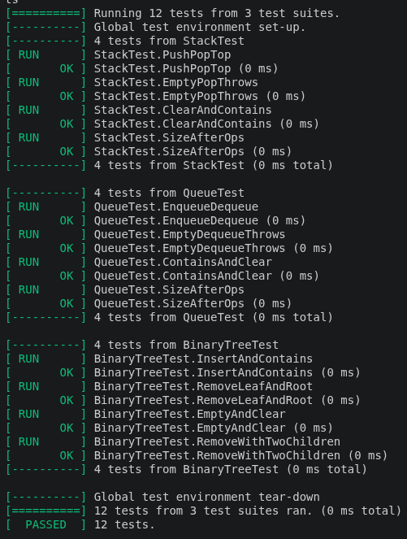
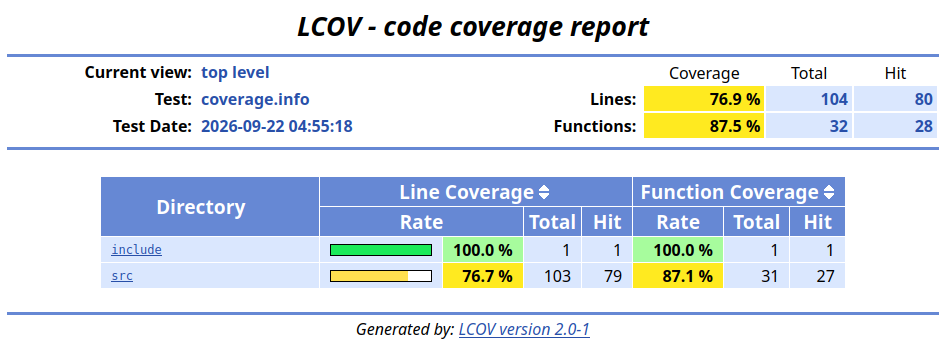
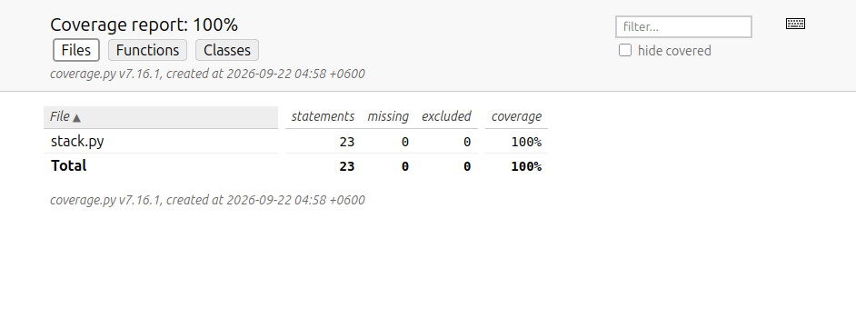

# Отчёт по лабораторной работе №4

**Тема:** Реализация структур данных и тестирование

**Выполнил:** faidger

**Ссылка на репозиторий:** https://github.com/faidger/Laba4

---

## 1. Цель работы

Реализовать основные структуры данных на C++, обеспечить их тестирование, получить отчёт о покрытии кода. Дополнительно реализовать одну структуру данных на Python с аналогичным набором операций и протестировать её.

---

## 2. Постановка задачи

1. Реализовать на C++ три структуры данных: стек, очередь, бинарное дерево поиска.
2. Для каждой структуры реализовать базовые операции (добавление, удаление, вывод) и дополнительные (поиск, очистка, размер).
3. Создать консольное приложение с командами для работы со всеми структурами.
4. Обеспечить многофайловую структуру проекта (.h и .cpp) и сборку в один исполняемый файл.
5. Подключить фреймворк тестирования Google Test, написать тесты, покрывающие корректные и граничные случаи.
6. Добиться покрытия кода не менее 70% и сгенерировать HTML-отчёт с помощью lcov/genhtml.
7. Реализовать стек на Python, написать тесты на pytest и получить HTML-отчёт покрытия (pytest-cov).

---

## 3. Структура проекта

    Laba4/
    ├── include/                 заголовочные файлы C++
    │   ├── Stack.h
    │   ├── Queue.h
    │   └── BinaryTree.h
    ├── src/                     реализации C++
    │   ├── Stack.cpp
    │   ├── Queue.cpp
    │   ├── BinaryTree.cpp
    │   └── main.cpp
    ├── tests/                   тесты Google Test
    │   └── test_structures.cpp
    ├── python/                  Python-часть
    │   ├── stack.py
    │   ├── test_stack.py
    │   ├── venv/
    │   └── htmlcov/             отчёт покрытия Python
    ├── build/                   каталог сборки
    │   ├── app
    │   ├── tests
    │   └── coverage_html/       отчёт покрытия C++
    ├── CMakeLists.txt
    ├── README.md
    ├── run_all.sh
    └── .gitignore

---

## 4. Реализованные структуры данных

### 4.1. Стек (Stack)

**Файл:** include/Stack.h, src/Stack.cpp

**Внутреннее представление:** std::vector<int>.

**Операции:**

- push(value) — добавить в вершину;
- pop() — снять с вершины (исключение при пустом стеке);
- top() — посмотреть верхний элемент;
- empty(), size(), clear();
- contains(value) — поиск значения;
- print() — вывод содержимого.

**Сложность:** все операции O(1), кроме contains/print — O(n).

### 4.2. Очередь (Queue)

**Файл:** include/Queue.h, src/Queue.cpp

**Внутреннее представление:** std::deque<int>.

**Операции:**

- enqueue(value) — добавить в конец;
- dequeue() — извлечь из начала (исключение при пустой очереди);
- front() — посмотреть первый элемент;
- empty(), size(), clear();
- contains(value) — поиск значения;
- print() — вывод содержимого.

**Сложность:** enqueue/dequeue/front — O(1).

### 4.3. Бинарное дерево поиска (BinaryTree)

**Файл:** include/BinaryTree.h, src/BinaryTree.cpp

**Внутреннее представление:** узлы Node { value, left, right }, корень root, счётчик count.

**Операции:**

- insert(value) — вставка;
- remove(value) — удаление (в т.ч. узла с двумя детьми через поиск минимума в правом поддереве);
- contains(value) — поиск;
- print() — симметричный обход (inorder);
- clear(), size(), empty().

**Сложность:** в среднем O(log n) для insert/remove/contains; O(n) в худшем случае (вырожденное дерево).

---

## 5. Консольное приложение

**Файл:** src/main.cpp

Приложение читает команды из стандартного ввода и управляет тремя структурами:

    stack push <v> | pop | top | print | size | clear | contains <v>
    queue enq <v>  | deq | front | print | size | clear | contains <v>
    tree insert <v>| remove <v> | print | size | clear | contains <v>
    help | exit

Пример сессии:

    > stack push 5
    > stack push 10
    > stack print
    Stack (top -> bottom): 10 5
    > queue enq 1
    > queue enq 2
    > queue print
    Queue (front -> back): 1 2
    > tree insert 10
    > tree insert 5
    > tree insert 15
    > tree print
    Tree (inorder): 5 10 15
    > exit

Ошибки (например, pop из пустого стека) перехватываются через try/catch и выводятся сообщением, программа не падает.

---

## 6. Тестирование (C++)

**Фреймворк:** Google Test 1.14.0.

**Файл:** tests/test_structures.cpp

**Всего тестов:** 12.

### Стек

- PushPopTop — добавление, чтение вершины, извлечение;
- EmptyPopThrows — исключение при pop/top из пустого стека;
- ClearAndContains — поиск и очистка;
- SizeAfterOps — размер после серии операций.

### Очередь

- EnqueueDequeue — добавление и извлечение;
- EmptyDequeueThrows — исключение при dequeue/front из пустой очереди;
- ContainsAndClear — поиск и очистка;
- SizeAfterOps — размер после серии операций.

### Дерево

- InsertAndContains — вставка и поиск;
- RemoveLeafAndRoot — удаление листа и корня;
- EmptyAndClear — пустота и очистка;
- RemoveWithTwoChildren — удаление узла с двумя детьми (проверка корректного размера).

**Результат:** все 12 тестов проходят.

---

## 7. Покрытие кода (C++)

**Инструменты:** gcov + lcov + genhtml.

**Команды:**

    lcov --capture --directory . --output-file coverage.info \
         --ignore-errors mismatch,gcov,source,negative
    lcov --remove coverage.info '/usr/*' '*/tests/*' '*/build/CMakeFiles/*' \
         --output-file coverage.info --ignore-errors unused,negative
    genhtml coverage.info --output-directory coverage_html

**Результат:**

- Покрытие строк: 76.9% (80 из 104)
- Покрытие функций: 87.5% (28 из 32)

Отчёт сохранён в build/coverage_html/index.html.

---

## 8. Python-реализация

**Файл:** python/stack.py

Реализован стек с тем же набором операций, что и на C++: push, pop, top, empty, size, clear, contains, __str__.

**Тесты:** python/test_stack.py (pytest, 5 тестов).

**Результат:** все 5 тестов проходят, покрытие — 100%.

HTML-отчёт: python/htmlcov/index.html.

---

## 9. Автоматизация

**Файл:** run_all.sh

Скрипт выполняет полный цикл:

1. чистая сборка C++ проекта;
2. запуск тестов C++;
3. генерация отчёта покрытия C++;
4. запуск Python-тестов с покрытием;
5. вывод путей к артефактам.

**Запуск:**

    ./run_all.sh

---

## 10. Итоги

- Реализованы три структуры данных на C++ с базовыми и дополнительными операциями.
- Создано консольное приложение с командами для управления структурами.
- Проект собирается через CMake, многофайловая структура.
- 12 модульных тестов на Google Test — все проходят.
- Покрытие C++ — 76.9% строк, 87.5% функций (выше требуемых 70%).
- Python-стек реализован, покрыт 5 тестами pytest — 100%.
- Сгенерированы HTML-отчёты покрытия для C++ и Python.
- Проект размещён на GitHub: https://github.com/faidger/Laba4

---

## Приложение. Скриншоты

1. Работа консольного приложения.
2. Прохождение тестов C++ (12/12).
3. Отчёт покрытия C++ (LCOV).
4. Прохождение тестов Python (5/5).
5. Отчёт покрытия Python (100%).
